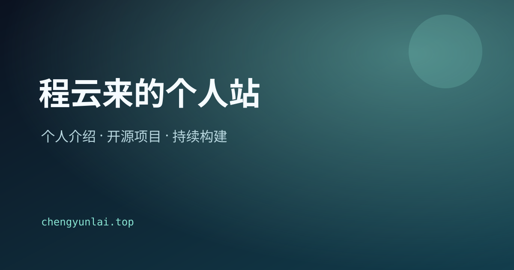

# 程云来的中文个人站

这是基于 [Once UI Magic Portfolio](https://github.com/once-ui-system/magic-portfolio) fork 的中文个人站，主域名为 [chengyunlai.top](https://chengyunlai.top)。当前首版聚焦两类内容：个人介绍与开源项目。

项目数据来自 [Chengyunlai 的 GitHub](https://github.com/Chengyunlai)，未来可将独立项目部署到 `*.chengyunlai.top` 二级域名。

本 fork 的主要改动：

- 将主站文案、导航、项目卡片和日期格式改为中文。
- 使用程云来的公开开源项目替换模板示例内容。
- 关闭博客、相册和订阅功能，减少首版维护面。
- 将 SEO 主域名改为 `https://chengyunlai.top`。
- 使用系统中文字体，构建时不依赖 Google Fonts 网络下载。
- 保留 Once UI 署名与 CC BY-NC 4.0 许可证链接。



## 开始使用

**1. 克隆仓库**
```
git clone https://github.com/Chengyunlai/magic-portfolio.git
```

**2. 安装依赖**
```
npm install
```

**3. 启动开发服务器**
```
npm run dev
```

**4. 修改站点配置**
```
src/resources/once-ui.config.ts
```

**5. 修改个人内容**
```
src/resources/content.tsx
```

**6. 添加开源项目**
```
在 `src/app/work/projects` 新增一个 `.mdx` 文件
```

本项目使用 [Once UI](https://once-ui.com) 和 [Next.js](https://nextjs.org) 构建，需要 Node.js 22+。

## 部署

生产环境构建：

```bash
npm run build
npm run start
```

在 Ubuntu 上可使用 PM2 运行 Next.js，再由 Nginx 将 `chengyunlai.top` 和项目二级域名反向代理到对应服务。

原模板文档见 [Once UI Magic Portfolio 文档](https://docs.once-ui.com/docs/magic-portfolio/quick-start)。

## 功能

### Once UI
- 使用 [Once UI](https://once-ui.com) 的设计令牌、组件和能力。

### SEO
- 使用 `next/og` 自动生成 Open Graph 和 X 分享图。
- 根据内容文件自动生成 Schema 和页面元数据。

### Design
- 响应式布局，适配不同屏幕尺寸。
- 克制的动效与视觉设计。
- 通过 [data attributes](https://once-ui.com/docs/theming) 灵活定制主题。

### Content
- 根据内容配置按需显示页面区块。
- 可启用或关闭博客、项目、相册和关于页。
- 自动生成社交链接。
- 支持为 URL 配置密码保护。

## 原作者

Lorant One: [Threads](https://www.threads.net/@lorant.one) / [LinkedIn](https://www.linkedin.com/in/lorant-one/)

## License

本项目及其修改版本继续遵循 CC BY-NC 4.0：必须保留署名并注明修改，不得用于商业用途。页脚保留 Once UI 署名链接，完整条款见 [`LICENSE`](LICENSE)。

如需商业使用，请先联系原作者确认授权范围。
